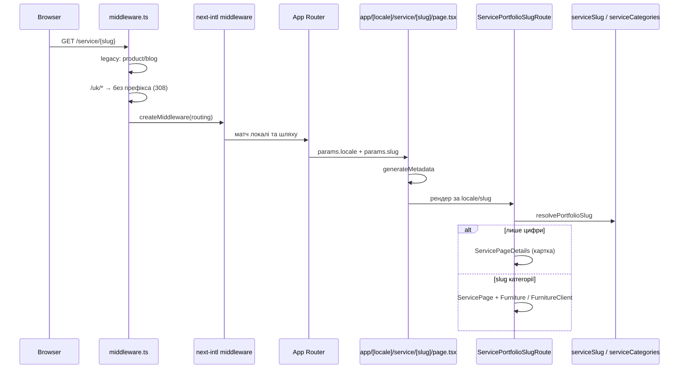

# T-Mebel — фронтенд (Next.js)

Публічний сайт меблевої студії та клієнтська адмін-панель. Дані й авторизація — через окремий HTTP API (див. нижче).

## Стек

| Шар             | Технології                                                                                                   |
| --------------- | ------------------------------------------------------------------------------------------------------------ |
| Framework       | **Next.js 15** (App Router), **React 19**, **TypeScript**                                                    |
| UI              | **MUI 7**, Emotion, CSS Modules (частина віджетів)                                                           |
| Дані            | **TanStack Query v5**, **Axios**                                                                             |
| i18n            | **next-intl** (локалі `uk`, `ru`, `en`)                                                                      |
| Форми / UX      | react-hook-form, react-hot-toast                                                                             |
| Медіа / графіки | embla-carousel, recharts                                                                                     |
| Аналітика       | **Google tag** (GA4 + Google Ads), кастомні конверсії на ключові події; **Vercel Analytics**, Speed Insights |
| Якість          | ESLint (eslint-config-next), **Prettier**, **Vitest**, Testing Library, **Husky** (pre-commit)               |

## Структура `src/`

Орієнтація на **Feature-Sliced Design** (логічний поділ, не офіційний FSD-тулінг):

- **`app/`** — маршрути Next (`[locale]/…` для локалізованих сторінок, окремо `signin`, дублікати без префікса локалі для типового `uk` за правилами `localePrefix: 'as-needed'`).
- **`entities/`** — доменні сутності (product, reviews, admin API hooks, services).
- **`features/`** — сценарії (наприклад `auth`: вхід, refresh, вихід).
- **`widgets/`** — великі блоки UI (шапка, адмін-оболонка, форми, галереї).
- **`shared/`** — багаторазовий UI, `api/base` (axios), React Query provider.
- **`views/`** — композиція сторінок з віджетів.
- **`i18n/`**, **`messages/`** — маршрутизація локалей і JSON-повідомлення (джерело типів для `uk.json` у `next.config.ts`).
- **`context/`** — React context (наприклад таби адмінки).
- **`middleware.ts`** — i18n + legacy-редиректи (`/product/:id` → `/service/:id`, `/blog` → головна).
- **`test/`** — спільний setup і обгортки для тестів.

Детальний опис потоку табів портфоліо та резолву **`/service/[slug]`** — у розділі **«Портфоліо `/service`: таби та slug»** в кінці файлу.

Аліас імпортів: `@/*` → `src/*` (див. `tsconfig.json`).

## Особливості

- **Адмінка / аналітика:** у розділі «Аналітика» — дашборд з даними про відвідування, кліки по дзвінках, маршрути сторінок тощо (з бекенду). На публічному сайті підключено **Google tag** (`gtag.js`: GA4 і Google Ads). Для важливих для бізнесу дій налаштовані **кастомні конверсії**: події до Google та реєстрація на бекенді (контактні форми, попапи тощо).
- **Локалізація:** `defaultLocale: 'uk'`, префікс у URL лише коли не типова локаль; `localeDetection: false`.
- **SEO:** `metadata` і JSON-LD у кореневому `layout`, `sitemap.ts`.
- **API:** базовий URL бекенду задається змінною **`NEXT_PUBLIC_API_BASE_URL`** (без сліша в кінці). Шаблон — у **`.env.example`**; для локальної роботи скопіюйте його в **`.env`** або **`.env.local`**. У продакшені (наприклад Vercel) задайте ту саму змінну в налаштуваннях проєкту. Використання: `src/shared/api/base.ts`, `src/utils/refreshToken.ts`.
- **Auth:** JWT у `localStorage`, refresh через `withCredentials` на `/auth/refresh`; захист сторінок адмінки — на клієнті, реальна безпека — на бекенді.
- **Збірка:** у `next.config.ts` увімкнено експериментальний `optimizeCss`, ESLint під час build вимкнено (`ignoreDuringBuilds`); зображення з `storage.googleapis.com`.
- **Pre-commit:** `format:check` → `lint` → `vitest run` (скрипт `precommit` + Husky). Форматування: **Prettier** (`npm run format`).

## Скрипти

```bash
npm run dev          # next dev --turbopack
npm run build
npm run start
npm run format       # prettier --write .
npm run format:check # перевірка без запису
npm run lint
npm test             # vitest run
npm run test:watch
npm run test:coverage
```

## Вимоги

- Node.js, сумісний із Next 15 (рекомендовано актуальний LTS)
- npm (або сумісний клієнт)

## Локальний запуск

```bash
npm install
cp .env.example .env   # Windows PowerShell: Copy-Item .env.example .env
npm run dev
```

Відкрийте [http://localhost:3000](http://localhost:3000). Для повного функціоналу (форми, адмінка) має бути доступний бекенд за URL з `NEXT_PUBLIC_API_BASE_URL`.

---

## Портфоліо `/service`: таби та slug

Один динамічний сегмент **`[slug]`**: або **числовий id** роботи (`/service/17`), або **латинський slug категорії** (наприклад кухня — `kukhnia-na-zamovlennia-kharkiv` для `uk`). Завдяки **`localePrefix: 'as-needed'`** у браузері часто видно `/service/…` без `/uk`, але **next-intl** усередині відповідає через дерево **`/[locale]/service/[slug]`** для всіх локалей, включно з **`uk`** (не відсікуй `uk` у цьому layout — буде 404).

### Ланцюжок запиту



| Крок | Файл                                                                | Що робить                                                                                                                                                                                                                                                                          |
| ---- | ------------------------------------------------------------------- | ---------------------------------------------------------------------------------------------------------------------------------------------------------------------------------------------------------------------------------------------------------------------------------- | --- | --------------------------------------- |
| 1    | `src/middleware.ts`                                                 | Редірект `/product/:id` → `/service/:id`; `/blog` → `/`; для **`/uk/...`** знімає префікс (**308**). Далі **`createMiddleware(routing)`**.                                                                                                                                         |
| 2    | `src/i18n/routing.ts`                                               | Локалі `uk                                                                                                                                                                                                                                                                         | ru  | en`, **`localePrefix: 'as-needed'`\*\*. |
| 3    | `src/app/[locale]/service/[slug]/page.tsx`                          | **`generateStaticParams`**: id з `getPortfolioProductIds()` (`src/shared/lib/productCatalog.ts`) + **`listPublishedCategorySlugs(locale)`**. **`dynamicParams: true`**. **`generateMetadata`** → **`generateServicePortfolioMetadata`**. Рендер → **`ServicePortfolioSlugRoute`**. |
| 4    | `src/shared/lib/servicePortfolioMetadata.ts`                        | **`resolvePortfolioSlug`** → мета карточки (`data_{id}`) або категорії (`seoServiceCategory`), інакше **`notFound()`**.                                                                                                                                                            |
| 5    | `src/views/ServicePortfolioSlugRoute/ServicePortfolioSlugRoute.tsx` | Повторний **`resolvePortfolioSlug`**: **`product`** → **`ServicePageDetails`**; **`category`** → **`ServicePage`** + JSON-LD крошки (`breadcrumbJsonLd.ts`).                                                                                                                       |
| 6    | `src/views/ServicePage/ServicePage.tsx`                             | Обгортка сторінки портфоліо → **`Furniture`**.                                                                                                                                                                                                                                     |
| 7    | `src/widgets/furniture/ui/FurnitureClient.tsx`                      | Таби та сітка карток; див. нижче.                                                                                                                                                                                                                                                  |

### Резолв `slug` (сервер і метадані)

**Файл:** `src/shared/lib/serviceSlug.ts`

```typescript
export function resolvePortfolioSlug(
  locale: AppLocale,
  slug: string,
): ResolvedPortfolioSlug | null {
  const trimmed = slug.trim();
  if (!trimmed) return null;
  if (/^\d+$/.test(trimmed)) {
    return { kind: "product", productId: trimmed };
  }
  const category = resolveCategoryFromSlug(locale, trimmed);
  if (category) return { kind: "category", category };
  return null;
}
```

### Конфіг категорій і табів

**Файл:** `src/shared/lib/serviceCategories.ts`

- **`SERVICE_CATEGORY_TAB_ORDER`** — порядок табів і кодів **`KITCHEN` … `BEDROOM`**.
- **`getCategorySlug(locale, code)`** — сегмент URL і **`href`** таба з slug.
- **`resolveCategoryFromSlug(locale, segment)`** — з URL назад у код категорії (клієнт для активного таба).
- **`categoryFromTabId` / `tabIdFromCategory`** — зв’язок id таба `1…4` ↔ код.

Фільтрація продуктів по **`product.category`** узгоджена з порядком через **`SERVICE_CATEGORY_TAB_ORDER`** у **`src/widgets/furniture/model/useDataFurniture.tsx`**.

### Перемикання табів (клієнт)

**Файл:** `src/widgets/furniture/ui/FurnitureClient.tsx`

1. **`usePathname()`** (`@/i18n/navigation`) — шлях без префікса локалі для default locale.
2. Регекс **`/service/([^/]+)/?$`** → останній сегмент після **`/service/`**.
3. Якщо сегмент **не** збігається з `/^\d+$/` → **`resolveCategoryFromSlug(locale, segment)`** → **`tabFromUrl`**.
4. **Активний таб:** **`displayedTab = tabFromUrl ?? active`** (`active` з **`useDataFurniture`** — для табів без опублікованого slug).
5. Якщо **`getCategorySlug(locale, code)`** повернув рядок → **`Link href={/service/${slug}}`** (локаль **`ru`/`en`** додається через next-intl).
6. Якщо slug категорії ще не заведено → **`span` + onClick**; якщо користувач був на URL категорії (**`tabFromUrl`**), перед **`setActive`** викликається **`router.push('/service')`**.

Стилі: **`src/widgets/furniture/ui/Furniture.module.css`** — **`navItem`**, **`active`** на **`li`**, **`navItemLink`** всередині.

### Тексти та SEO категорії

Ключ **`seoServiceCategory`** у **`src/messages/uk.json`**, **`ru.json`**, **`en.json`** (наприклад **`KITCHEN.title`**, **`pageTitle`**, **`breadcrumbName`**).

### Інше

- **`src/app/sitemap.ts`** — додає **`service/{slug}`** для категорій через **`listPublishedCategorySlugs`** по кожній локалі.
- **`src/app/service/page.tsx`** — hub **`/service`** (uk без `[locale]` у дереві).
- **`src/app/[locale]/service/page.tsx`** — hub **`/ru/service`**, **`/en/service`**.

### Як додати категорію з табом по URL

1. Заповнити **`CATEGORY_SEGMENTS`** у **`serviceCategories.ts`** для кожної локалі.
2. Додати **`seoServiceCategory.{CODE}`** у **`messages/*.json`**.
3. **`generateStaticParams`** і sitemap підхоплять slug через **`listPublishedCategorySlugs`**.
4. У **`FurnitureClient`** таб автоматично стане **`Link`**, коли з’явиться **`getCategorySlug`**.

### Не робити

- Не відсікувати **`locale === 'uk'`** у **`src/app/[locale]/service/[slug]/page.tsx`** без заміни архітектури — саме цей файл обробляє «голий» **`/service/…`** після поведінки next-intl.
- Не дублювати паралельно **`app/service/[slug]`** і **`app/[locale]/service/[slug]`** без узгодження — легко отримати роз’їзд маршрутів.
