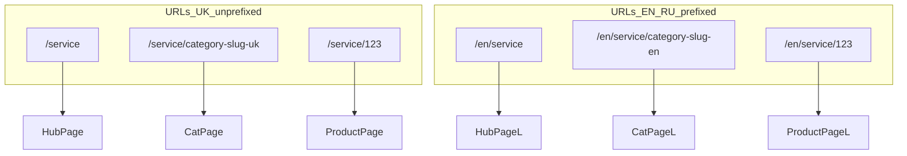

# SEO-PLAN: категории портфолио без регресса SEO

Документ живой: после финализации slug в таблице ниже — обновлять её здесь же.

## Пошаговое внедрение (фазы)

Так проще катить постепенно: каждая фаза даёт проверяемый результат без «большого взрыва».

| Фаза  | Содержание                                                                                                                                                                                            | Критерий готовности                                                                                    |
| ----- | ----------------------------------------------------------------------------------------------------------------------------------------------------------------------------------------------------- | ------------------------------------------------------------------------------------------------------ |
| **0** | Заполнить таблицу slug (uk/ru/en), зафиксировать стайлгайд нормализации (дефисы, Харків/Харьков, ё/є).                                                                                                | Таблица в этом файле не TBD.                                                                           |
| **1** | Модуль `serviceCategories` (или аналог): locale → segment, segment → `KITCHEN`/`WARDROBE`/…, связь с фильтром как в `useDataFurniture`. Без смены роутов — только код и тесты/импорт из одного места. | Один источник правды подключается из консоли/Stories или временного вызова без прод-роутов.            |
| **2** | Роутинг: `service/[id]` → `service/[slug]` с ветвлением число / категория / `notFound`; зеркало под `[locale]`; `generateStaticParams`; карточки работ по-прежнему `/service/{число}`.                | Ручной QA: продукты UK/EN/RU открываются, неизвестный slug — 404.                                      |
| **3** | Метаданные + JSON-LD breadcrumbs для страниц категорий; i18n ключи `seoServiceCategory.*` по **коду** категории (не по строке URL).                                                                   | View-source / DevTools: уникальные title, canonical, `alternates.languages` совпадают с правилами hub. |
| **4** | `Furniture` / `FurnitureClient`: табы как `Link`, активная вкладка из `usePathname`; при необходимости проп категории с сервера.                                                                      | UX как табы, URL меняется, «Назад» работает.                                                           |
| **5** | `sitemap.ts`: все пары locale × категория; UTF-8 в URL ок.                                                                                                                                            | В `sitemap.xml` появились URL категорий.                                                               |
| **6** | Контент: H1 + абзац(ы) по категориям; опционально FAQ.                                                                                                                                                | Нет «тонких» дублей без уникального блока текста.                                                      |

**Зависимости:** 1 → 2 → 3 логично идти подряд; 4 можно параллелить с 3 после того как есть стабильные пути; 5 после 2–3; 6 в любой момент после появления живых URL (лучше не откладывать надолго).

Если выберете **случай A** (один латинский slug для всех локалей, статические папки рядом с `[id]`), фазы 1–2 упрощаются: без merge `[slug]`, но появляется дублирование роутов под каждый сегмент — см. раздел «Случай A» ниже.

---

## Цель и ограничения

- Дать каждой категории (кухні, шафи, торгові меблі, спальні) **отдельный индексируемый URL**, свои `title` / `description` / OG / canonical / `alternates.languages`.
- **Не сломать** текущие карточки работ: `src/app/service/[id]/page.tsx`, `src/app/[locale]/service/[id]/page.tsx`, ссылки в `FurnitureClient` вида `/service/${item.id}`.
- Сохранить правила локалей: `src/i18n/routing.ts` — `defaultLocale: "uk"`, `localePrefix: "as-needed"` (UK **без** префикса `/uk`, EN/RU **с** префиксом), плюс редирект `/uk/...` → `...` в `src/middleware.ts`.
- Canonical для страниц должен совпадать с уже принятой схемой (как на `src/app/[locale]/service/page.tsx`): UK → `https://t-mebel.com.ua/service/...`, EN/RU → `https://t-mebel.com.ua/{locale}/service/...`.

## Важный факт по роутингу Next.js

В одном родителе **нельзя** иметь две папки `service/[id]` и `service/[category]` — это один и тот же динамический уровень.

### Случай A: один и тот же сегмент URL для всех локалей (латиница)

Можно оставить **статические** папки рядом с `service/[id]` (статика побеждает динамику): например `service/kitchens/page.tsx`. Плюс зеркало под `[locale]`.

### Случай B: человекочитаемые slug «под выдачу», **разные по локали** (укр / рус / en)

Пример смысла (не финальный копирайт): «кухня на заказ харьков», «шкаф-купе на заказ харьков», «стеллаж на заказ харьков», «спальни на заказ харьков». Для **uk** логичнее орфография и топоним **Харків**, для **ru** — привычные формы вроде **Харьков**; для **en** — латиница или транслит (отдельное решение).

Тогда **набор path segment разный** для `uk` vs `ru` vs `en`. Держать отдельные папки на файловой системе на каждую фразу и локаль — неудобно. **Рекомендуемая стратегия:** один динамический сегмент **`service/[slug]`** вместо нынешнего `service/[id]`:

1. Если `slug` совпадает с **числовым** id продукта (`/^\d+$/`) → текущее поведение **карточки работы** (как сейчас `service/[id]/page.tsx`).
2. Иначе если `slug` входит в **allowlist категорий для текущей локали** → страница категории (галерея + уникальные мета/H1/текст).
3. Иначе → `notFound()`.

**generateStaticParams** должен отдавать **все** статические варианты: пары `{ slug: "123" }` из каталога + `{ slug: "<category-slug>" }` для каждой категории **в разрезе локали** (для дерева `app/[locale]/service/[slug]` — комбинации `locale` + `slug`; для дерева без префикса `app/service/[slug]` — только uk-slug и числовые id).

Регрессия по URL карточек: **не меняются** (`/service/15`, `/en/service/15`), если правило «числа → продукт» остаётся.

### Нормализация фразы в сегмент URL

- Пользователям и поиску показывается «человеческая» фраза; **в пути** — одна договорённость: обычно **нижний регистр**, **пробелы → дефисы**, без «ломаной» пунктуации; буква **ё/є**, **э/е** — зафиксировать в стайлгайде один раз.
- Кириллица в URL **допустима** (UTF-8); в sitemap/XML и в логах будет percent-encoding — это нормально. Проверить копипаст ссылок из адресной строки и `Link` из next-intl.
- Имена папок в репозитории остаются **`[slug]`**, а не кириллические имена каталогов — сегмент задаётся данными и `generateStaticParams`, не файловой структурой.

### Таблица slug (заполнить перед реализацией)

| Ключ категории (код) | UK сегмент                            | RU сегмент                            | EN сегмент |
| -------------------- | ------------------------------------- | ------------------------------------- | ---------- |
| `KITCHEN`            | `кухня-на-замовлення-харків` (пример) | `кухня-на-заказ-харьков` (пример)     | TBD        |
| `WARDROBE`           | TBD                                   | `шкаф-купе-на-заказ-харьков` (пример) | TBD        |
| `STORE`              | TBD (торгові / стелажі — решить)      | `стеллаж-на-заказ-харьков` (пример)   | TBD        |
| `BEDROOM`            | TBD                                   | `спальни-на-заказ-харьков` (пример)   | TBD        |

Важно: **hreflang** на каждой такой странице должен указывать на **правильный** URL каждой локали (как на hub), а не дублировать один slug для всех.

## Архитектура страниц

- **Hub** `/service`: обзор (как сейчас через `ServicePage`); метаданные — текущий `seoPortfolio`.
- **Категория** `/service/{slug}`: тот же визуальный блок портфолио, но **предвыбранная категория** + уникальный H1/текст/FAQ + свои метаданные.
- **Продукт** `/service/{id}`: **числовой** сегмент обрабатывается той же динамической веткой **`[slug]`** после ветвления по правилам выше.

## UX и верстка: отдельные макеты не нужны

- **Новые «страницы» в смысле дизайна** не обязательны: остаётся текущий каркас `ServicePage` + `Furniture` (табы + сетка карточек).
- **Для человека** — как **те же табы**: вместо `onClick` + `useState` — `Link` из `src/i18n/navigation.ts` на другой URL; клиентская навигация Next без полной перезагрузки.
- Плюсы: адресная строка, «Назад/Вперёд», открыть категорию в новой вкладке.
- **Опционально для SEO** (п. 8): уникальный **H1** и абзац(ы) в существующую сетку `container`, не новый лендинг с нуля.

## Чеклист реализации (порядок снижает риск)

### 1. Общие константы и маппинг

- Модуль (например `src/shared/lib/serviceCategories.ts`): для каждой локали `uk | ru | en` — маппинг **URL segment → ключ категории** и обратно **ключ → segment**; ключ связан с фильтром как в `useDataFurniture.tsx` (`KITCHEN`, `WARDROBE`, …).
- Один модуль для `generateMetadata`, табов, `generateStaticParams`, sitemap — **один источник правды**.
- Разделить: **internal key** vs **отображаемый** H1/текст в переводах.

### 2. Маршруты (замена `[id]` на `[slug]` при стратегии B)

- `src/app/service/[id]/page.tsx` → `service/[slug]/page.tsx` с `resolveServiceSlug(slug, 'uk')`.
- `src/app/[locale]/service/[id]/page.tsx` → `service/[slug]/page.tsx` с `locale` из `params`.
- Общая логика `generateMetadata` + страницы в хелперах, чтобы UK и `[locale]` не разъезжались.
- Категория: `JsonLd` + `buildBreadcrumbListJsonLd` — Главная → Портфолио → категория; `item.path` = тот же путь, что в `Link`.

### 3. Метаданные и i18n

- В messages: ключи по **internal key** (`KITCHEN`), например `seoServiceCategory.KITCHEN.title`.
- `generateMetadata` для категории: `openGraph.url` = canonical, полный `alternates.languages` с **своим** segment на локаль.
- Дерево `src/app/service/` без `[locale]`: locale = `uk`.

### 4. Виджет портфолио

- Проп категории с сервера при необходимости; на hub — как сейчас или дефолт первой.
- Табы: `Link` с `href` `/service/<segment>` из конфига **для текущей локали**.
- Подсветка: `usePathname()` + учёт decode/нормализации.
- Убрать `useState` как источник истины для активной категории на SEO-страницах.

### 5. Hub `/service`

- Hub **оставить**; опционально текст со ссылками на категории.

### 6. Sitemap

- `src/app/sitemap.ts`: пары (locale, category) → `service/{segment}`; проверка для не-ASCII.

### 7. Middleware

- Сохранить редиректы `product` → `service`, `blog` → `/`, UK unprefixed.
- Латинские slug не должны совпадать с `uk|ru|en` как ложная локаль.

### 8. Контент против «thin pages»

- Уникальный **H1**, 1–2 абзаца; опционально FAQ по категории.

## Регресс-тесты (ручные, перед продом)

- UK: `/service`, `/service/<uk-category-segment>`, `/service/{numericId}` — мета, canonical, крошки, табы.
- EN/RU: `/en/service/...`, `/ru/service/...` со **своими** сегментами; hreflang.
- Неверный сегмент → `notFound()`.
- `sitemap.xml`: URL категорий по локалям.
- У категорий разные `title` в `<head>`.

## Что не трогать в первой итерации

- Смена URL карточек работ (числовые id).
- Два живых URL на одну категорию без одного canonical и 301.

Переход на merged `service/[slug]` (случай B) — осознанное изменение файлов `[id]`, внешние URL продуктов не меняются.

## Связанные файлы (ориентир)

- `src/app/service/page.tsx`, `src/app/[locale]/service/page.tsx` — hub, образец metadata.
- `src/app/service/[id]/page.tsx`, `src/app/[locale]/service/[id]/page.tsx` — текущие карточки (будут заменены при случае B).
- `src/widgets/furniture/ui/Furniture.tsx`, `FurnitureClient.tsx`, `useDataFurniture.tsx`.
- `src/middleware.ts`, `src/i18n/routing.ts`, `src/app/sitemap.ts`.
- `src/shared/lib/breadcrumbJsonLd.ts`, `src/shared/ui/JsonLd/JsonLd.tsx`.
